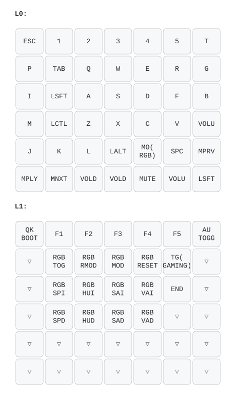

# kucheza `amacleod` keymap

Personal gaming-focused layout, shifted one column right of standard WASD
placement so A/S/D sit under the ring/middle/index fingers in home
position. VIA/Vial is enabled for on-the-fly remapping.

The diagram above is a plain 7-column grid (via
[keymap-drawer](https://github.com/caksoylar/keymap-drawer)), not the
board's actual physical shape -- Kucheza's irregular layout (offset thumb
cluster, 5-way nav cluster, isolated foot pedal) doesn't map cleanly onto
keymap-drawer's physical-layout resolution for this board. Labels and key
order are exact; positions/shape are not.
