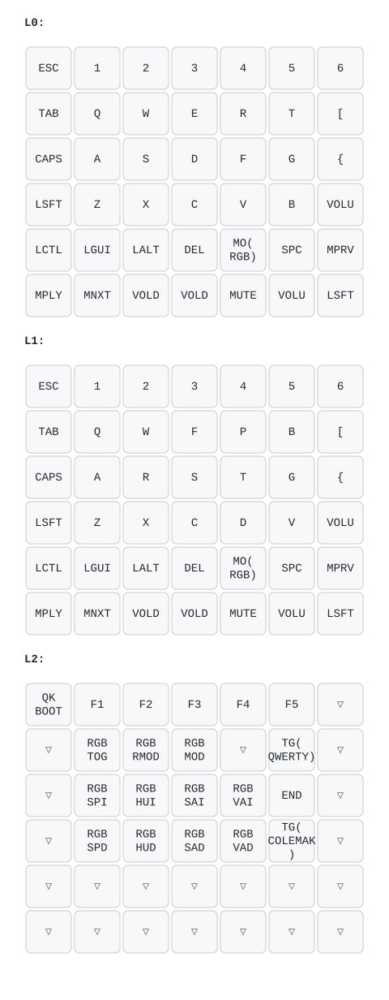

# kucheza `default` keymap

Plain, unshifted QWERTY layout (Sadek's original default layers,
untouched) with VIA/Vial enabled for on-the-fly remapping. Meant as a
give-away-ready starting point -- no custom RGB tuning or extra keycodes.

The diagram above is a plain 7-column grid (via
[keymap-drawer](https://github.com/caksoylar/keymap-drawer)), not the
board's actual physical shape -- see the `amacleod` keymap's readme for
why. Labels and key order are exact; positions/shape are not.
